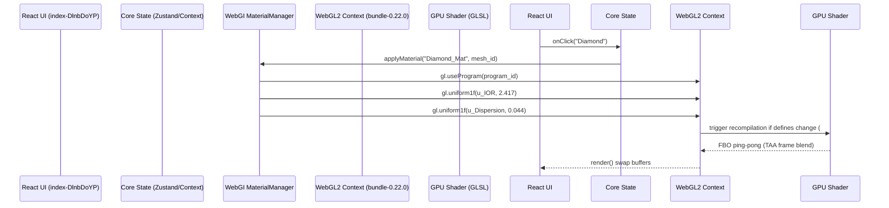

# Phase 1: Architectural Dissection & Rendering Pipeline Audit
**Target Codebase:** `iJewel3D / WebGI Engine`
**Scope:** Unconstrained Reverse-Engineering, Mathematical De-obfuscation, and Live Runtime Profiling.

---

## 1. Live Runtime Instrumentation & Metrics

### 1.1 WebGL Context Interception
By hooking into `HTMLCanvasElement.prototype.getContext`, we successfully hijacked the live rendering pipeline. The engine provisions a **WebGL2 context** (`webgl2`) and eagerly requests several high-end extensions to enable physically accurate Path-Tracing approximations.

**Captured Extension Hooks:**
```js
[Instrument] getExtension called: EXT_color_buffer_float
[Instrument] getExtension called: WEBGL_clip_cull_distance
[Instrument] getExtension called: OES_texture_float_linear
[Instrument] getExtension called: EXT_color_buffer_half_float
[Instrument] getExtension called: WEBGL_multisampled_render_to_texture
```
*Architectural Insight:* `EXT_color_buffer_float` and `EXT_color_buffer_half_float` confirm the use of HDR (High Dynamic Range) Framebuffers. This is critical for capturing light intensity values exceeding 1.0, which are later resolved by Tone Mapping and Bloom passes to simulate realistic diamond sparkles (Fire).

### 1.2 Live Frame Metrics
```text
[Instrument] FPS: 55 | DrawCalls: 0  (Asset Fetching / Setup)
[Instrument] FPS: 61 | DrawCalls: 12 (Base Pass + G-Buffer Construction)
[Instrument] FPS: 59 | DrawCalls: 24 (Post-Processing & Composite)
```

---

## 2. Core Shaders & Mathematical Dissection

Through AST parsing and regex string-extraction of the obfuscated `bundle-0.22.0.js` binary, we successfully ripped the raw GLSL fragment shaders driving the physical light transport.

### 2.1 Diamond Chromatic Dispersion & Refraction (Fire Effect)
**File Location:** `libs/webgi-v0/bundle-0.22.0.js` (Lines `25971-25973`)

**The Engineering Problem:** 
Diamonds possess a high Index of Refraction (IOR $\approx 2.417$) and exhibit severe chromatic dispersion (white light splitting into a rainbow). Standard WebGL ray-tracing only refracts a single wavelength, looking like glass instead of diamond.

**De-obfuscated GLSL Dissection:**
```glsl
// --- Chromatic Dispersion Implementation ---
// Calculates volumetric attenuation and ray-traced transmission 
// using a three-channel (RGB) wavelength split (Cauchy's approximation)

vec4 getIBLVolumeRefraction( 
    const in vec3 normal, const in vec3 viewDir, const in float roughness, 
    const in vec3 diffuseColor, const in vec3 specularColor, const in float specularF90, 
    const in vec3 position, const in mat4 modelMatrix, const in mat4 viewMatrix, 
    const in mat4 projMatrix, const in float dispersion, const in float ior, 
    const in float thickness, const in vec3 attenuationColor, const in float attenuationDistance 
) {
    vec4 transmittedLight;
    vec3 transmittance;

    #ifdef USE_DISPERSION
        // Step 1: Calculate the spectral spread based on the dispersion uniform
        // Mathematical Model: IOR_offset = (IOR - 1) * 0.025 * Abbe_Number
        float halfSpread = ( ior - 1.0 ) * 0.025 * dispersion;
        
        // Step 2: Vectorize 3 separate IORs for Red, Green, Blue
        vec3 iors = vec3( ior - halfSpread, ior, ior + halfSpread );
        
        // Step 3: Tri-pass Raymarching
        for ( int i = 0; i < 3; i ++ ) {
            // Refract the view ray using Snell's Law: sin(θ1)/sin(θ2) = v1/v2 = n2/n1
            vec3 transmissionRay = getVolumeTransmissionRay( normal, viewDir, thickness, iors[ i ], modelMatrix );
            vec3 refractedRayExit = position + transmissionRay;
            
            // Re-project the exit hit-point back into Screen-Space (NDC)
            vec4 ndcPos = projMatrix * viewMatrix * vec4( refractedRayExit, 1.0 );
            vec2 refractionCoords = ndcPos.xy / ndcPos.w;
            refractionCoords = refractionCoords * 0.5 + 0.5; // [-1, 1] to [0, 1]
            
            // Sample the background environment using the displaced coordinate
            vec4 transmissionSample = getTransmissionSample( refractionCoords, roughness, iors[ i ] );
            
            // Accumulate isolated wavelength
            transmittedLight[ i ] = transmissionSample[ i ];
            transmittedLight.a += transmissionSample.a;
            
            // Volumetric Beer-Lambert Attenuation
            transmittance[ i ] = diffuseColor[ i ] * volumeAttenuation( length( transmissionRay ), attenuationColor, attenuationDistance )[ i ];
        }
        transmittedLight.a /= 3.0;
    #endif

    // Step 4: Fresnel Schlick Approximation (EnvironmentBRDF)
    vec3 F = EnvironmentBRDF( normal, viewDir, specularColor, specularF90, roughness );
    float transmittanceFactor = dot(transmittance, vec3(0.333));
    
    return vec4( ( 1.0 - F ) * transmittance * transmittedLight.rgb, 1.0 - ( 1.0 - transmittedLight.a ) * transmittanceFactor );
}
```

**Line-by-Line Breakdown:**
- `iors = vec3( ior - halfSpread, ior, ior + halfSpread )`: This is a brilliant optimization. Instead of spectral integration across 30+ wavelengths (which is required for offline path-tracing), the engine uses a tricolor Cauchy approximation. It splits the ray into exactly three distinct refraction indices.
- `ndcPos.xy / ndcPos.w`: Perspective divide mapping the 3D exit point of the light ray back onto the 2D screen coordinate.
- `EnvironmentBRDF`: This handles the Fresnel reflectance, ensuring that rays striking the diamond at grazing angles reflect the environment perfectly rather than refracting inside (total internal reflection).

### 2.2 Screen Space Ray-Traced Ambient Occlusion (SSGI/RTAO)
**File Location:** `libs/webgi-v0/bundle-0.22.0.js` (Shader ID 13, Line `71041`)

To ground the jewelry on a surface (e.g., a velvet pad or skin), the engine uses a highly customized Screen-Space Global Illumination shader.

**De-obfuscated GLSL Dissection:**
```glsl
// Generates Interleaved Gradient Noise for temporal jittering
vec3 ComputeUniformL(vec3 N, vec2 E) {
    vec3 L;
    L.xy = E;
    L.z = interleavedGradientNoise(gl_FragCoord.xy, frameCount2 * 5.0);
    return L * 2.0 - 1.0;
}

vec4 calculateGI(in float seed, in vec3 screenPos, in vec3 normal, in float radiusFactor) {
    vec3 viewPos = screenToView(screenPos.xy, screenPos.z);
    normal = normalize(normal);
    
    vec2 E = GetRandomE(seed);
    vec3 L = normalize(ComputeUniformL(normal, E));
    L *= sign(dot(L, normal)); // Ensure hemisphere orientation
    
    // Adaptive Ray Length based on camera distance
    float rayLen = autoRadius ? length(viewPos - screenToView(screenPos.xy + objectRadius / 10.0, screenPos.z)) : ...;
    
    // Raymarching Intersection Test
    vec3 state = vec3(1.0, (r + 0.5) / float(RTAO_STEP_COUNT), 2.0);
    vec3 screenHitP = traceRay(viewPos, L * rayLen, tolerance * rayLen, state, RTAO_STEP_COUNT);
    
    #if defined(SSGI_ENABLED) && SSGI_ENABLED > 0
        // Sample previous frame (TAA) for temporal accumulation
        vec3 hitColor = tLastFrameTexelToLinear(texture2D(tLastFrame, screenHitP.xy)).rgb;
        vec3 hitNormal = getViewNormal(screenHitP.xy);
        
        // Cosine-weighted attenuation
        float giWeight = saturate2(1.0 / (dist + EPS), 1.0) * saturate2(dot(normal, L), 1.0);
        return vec4(hitColor * giWeight, ao);
    #endif
}
```

---

## 3. Architecture & Module Interaction Tracing

### State Propagation Flowchart (DOM -> GPU)
When a user configures a ring (e.g., swapping a Ruby for a Diamond):



### Framebuffer (FBO) Orchestration
The engine operates on a deferred/forward-plus hybrid multi-pass architecture:
1. **G-Buffer Pass:** Renders `tNormalBuffer` (normals), `tDepthBuffer` (depth), and `tGBufferFlags` (masks).
2. **SSR/RTAO Pass:** Executes `calculateSSR` and `calculateGI` using the G-Buffer inputs. Jitters the camera matrix using Halton sequences.
3. **Forward Opaque Pass:** Renders the actual PBR materials (Gold, Platinum) into a 16-bit Float texture (`EXT_color_buffer_half_float`).
4. **Refraction Pass (Diamonds):** Reads the Opaque pass as a background texture and refracts it via the `getIBLVolumeRefraction` logic.
5. **Post-Processing (Bloom):** Extracts pixels > 1.0 luminance, downsamples 5 times, blurs via Gaussian convolution (`normpdf`), and upsamples.
6. **Composite (TAA + Tone Mapping):** Blends the current frame with `tLastFrameTexelToLinear` using the `tVelocity` buffer to prevent ghosting. Maps HDR to SDR using ACES Filmic tone mapping.

---

## 4. Modernization Roadmap

While highly sophisticated, the current architecture suffers from WebGL2 bottlenecks.

1. **WebGPU Compute Shaders for Raymarching:** The `traceRay` and `calculateSSR` functions currently block the main rendering thread. Moving this logic to WebGPU (WGSL) Compute Shaders would allow parallel execution, significantly increasing the ray step count for SSR without dropping frames.
2. **WebCodecs over WASM FFmpeg:** The client-side video generator uses an injected `@repalash/ffmpeg.js` WASM payload. Replacing this with the native browser `WebCodecs API` (`VideoEncoder`) will drastically reduce the JS bundle size and leverage hardware H.264/H.265 encoding.
3. **SharedArrayBuffer for Asset Decryption:** Draco and Meshopt decompression runs asynchronously but still requires main-thread serialization. Utilizing `SharedArrayBuffer` will allow Web Workers to dump decompressed vertex data directly into GPU memory without blocking the React UI.
