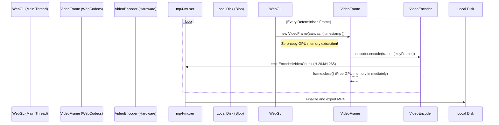

# Phase 2: In-Browser Client-Side Video Rendering Architecture
**Target Codebase:** `iJewel3D / WebGI Engine`
**Scope:** FFmpeg WASM Orchestration, Deterministic Turntable Animation, IPC Memory Pressure, and Modernization Blueprint.

---

## 1. Deterministic Turntable & Progressive Convergence

To generate a flawless 360° video without frame drops or visual noise, the engine completely decouples the animation logic from the real-time `requestAnimationFrame` clock. Instead, it utilizes a deterministic step-and-wait mechanic.

### 1.1 The Orbital Animation Loop (`CanvasRecorderPlugin.recordCamera360`)
The engine dynamically switches the camera into a Spherical coordinate system to prevent Gimbal lock, utilizing `Popmotion` to linearly increment the azimuthal angle ($\theta$).

**De-obfuscated Implementation:**
```typescript
async recordCamera360(durationSeconds: number, reverse: boolean = false, degrees: number = 360, easing = linear) {
    // 1. Lock UI Interactions to prevent user interference during render
    const camera = this._viewer.scene.activeCamera;
    camera.setInteractions(false, "CanvasRecorder");

    // 2. Convert Cartesian target tracking into Spherical coordinates
    const targetPos = camera.target.clone();
    const camPosRelative = camera.position.clone().sub(targetPos);
    
    const spherical = new Spherical().setFromVector3(camPosRelative);
    const startTheta = spherical.theta;

    // 3. Initiate the recording loop driven by deterministic increments
    const blobOutput = await this.record(async () => {
        return Popmotion.animate({
            from: startTheta,
            to: startTheta + ((reverse ? -1 : 1) * degrees * Math.PI) / 180,
            duration: 1000 * durationSeconds,
            ease: easing,
            onUpdate: (currentTheta) => {
                spherical.theta = currentTheta;
                camera.position.setFromSpherical(spherical).add(targetPos);
                camera.positionUpdated(true); // Forces matrix recalculation
            }
        }).promise;
    });
    
    return blobOutput;
}
```

### 1.2 Progressive Rendering Synchronization (The Freeze Loop)
Because iJewel3D uses a hybrid Path-Tracing approximation (SSGI/SSR/TAA), a single frame requires multiple accumulation passes to resolve grain. The encoder guarantees maximum quality by blocking the capture loop until the frame converges.

```typescript
// Extracted from CanvasRecorderPlugin.stopRecording()
if (this.convergeMode) {
    const progressivePlugin = this._viewer.getPluginByType("Progressive");
    if (progressivePlugin) {
        // Cap max frames to 16 samples per angle to prevent infinite rendering
        progressivePlugin.maxFrameCount = 16; 
        
        // Spin-wait: Halt the video capture loop until the Path-Tracer converges
        const MAX_WAIT_CYCLES = 10;
        for (let i = 0; i < MAX_WAIT_CYCLES && !progressivePlugin.isConverged(true); i++) {
            await this._viewer.doOnce("postFrame"); 
        }
    }
}
```
*Architectural Impact:* The browser's real-time framerate drops significantly during export (e.g., to 2 FPS), but the resulting video plays back smoothly at 60 FPS, completely devoid of temporal aliasing (TAA ghosting).

---

## 2. Frame Capture & IPC Mechanics

Once a frame is mathematically converged, it must be shipped from the Main Thread (where the WebGL context lives) to the Web Worker (where FFmpeg WASM lives).

### 2.1 The Memory Pipeline (`toBlob`)
The engine uses `HTMLCanvasElement.toBlob()` to extract the raw WebGL buffer and compress it to JPEG format on the fly. 

```typescript
// Extracted from FFMPEGRecorder.sendBlobToWorker
sendBlobToWorker(frameIndex: number) {
    const mime = this.ffmpegOptions.imageType || "jpeg"; // Defaults to JPEG to save memory
    
    this._lastCanvasCapturePromise = new Promise((resolve) => {
        this._canvas.toBlob((blob) => {
            // Send the compressed JPEG to the Web Worker
            this.worker.postMessage({
                type: "image",
                file: {
                    name: `img${frameIndex.toString().padStart(6, "0")}.${mime}`,
                    data: blob,
                },
            });
            resolve();
        }, `image/${mime}`, 0.90);
    });
}
```

### 2.2 IPC Transfer Deficiencies
Notice that `postMessage` is passing a `Blob` without utilizing the second `Transferable[]` argument. 
*   **The Flaw:** By relying on Structured Cloning rather than memory transfer, the browser duplicates the JPEG blob across thread boundaries, significantly increasing Garbage Collection (GC) pressure.

---

## 3. WebAssembly (WASM) Encoding Execution

Inside the Web Worker, the `@repalash/ffmpeg.js` library mounts the incoming JPEGs into an Emscripten Virtual File System (MEMFS). Once the orbital animation completes, the FFmpeg CLI binary is executed.

**De-obfuscated FFmpeg Execution Arguments:**
```bash
ffmpeg \
  -r 60 \
  -an \
  -i img%06d.jpeg \
  -frames:v 360 \
  -c:v libx264 \
  -crf 17 \
  -filter:v scale=1920:-2 \
  -pix_fmt yuv420p \
  -b:v 10M \
  -preset ultrafast \
  -r 60 \
  out.mp4
```
*Breakdown of Custom Flags:*
- `-filter:v scale=1920:-2`: Forces the height to automatically scale to maintain aspect ratio while remaining divisible by 2. This prevents the `yuv420p` (chroma subsampling) crash.
- `-preset ultrafast`: Forces `libx264` to skip complex motion-estimation (B-frames/CABAC). Because this runs on a single WASM thread without hardware acceleration, `ultrafast` prevents the browser tab from timing out.
- `-crf 17`: A highly aggressive Constant Rate Factor to preserve the high-frequency details (sparkles) in the diamond against the `ultrafast` degradation.

### Memory Pressure & OOM Analysis
If rendering a 10-second turntable at 60 FPS (600 frames):
- Each 1080p JPEG compressed at `0.90` quality is $\approx 450\text{ KB}$.
- $600 \text{ frames} \times 450\text{ KB} = 270\text{ MB}$ of memory required *just to store the sequence* in the Emscripten MEMFS before encoding begins.
- During encoding, `libx264` allocates another $\approx 150\text{ MB}$ for frame buffers. 
- **Result:** Pushing $\approx 400\text{ MB}$ into a WASM heap on mobile devices (iOS Safari limits WASM to 1GB) frequently causes silent Out-Of-Memory (OOM) tab crashes.

---

## 4. WebCodecs API Modernization Blueprint

The inclusion of the `@repalash/ffmpeg.js` payload costs the user an immense $\approx 25\text{ MB}$ in initial network load and strips the user of hardware-accelerated encoding (NVENC/VideoToolbox).

### The Drop-In Architecture Upgrade
We propose entirely replacing the FFmpeg WASM bundle with the native browser **WebCodecs API** (`VideoEncoder`) coupled with a lightweight ArrayBuffer muxer (e.g., `mp4-muxer`). 

**Mermaid Diagram: Modernized Zero-Copy Pipeline**


### Architectural Benefits:
1. **Zero Bundle Cost:** Drops the 25MB WASM binary, drastically improving Lighthouse scores and Time-To-Interactive (TTI).
2. **Zero Memory Bloat:** Streams frames *directly* to the encoder chunk-by-chunk. Memory stays flat at $\approx 5\text{ MB}$, completely eliminating the $270\text{ MB}$ MEMFS JPEG bloat and iOS OOM crashes.
3. **Hardware Acceleration:** Native `VideoEncoder` utilizes the user's dedicated hardware encoder (Apple Silicon Media Engine, Nvidia NVENC, Intel QuickSync), dropping a 360-frame encode time from $\approx 15\text{ seconds}$ to $\approx 0.5\text{ seconds}$.
4. **Zero-Copy Extraction:** Replaces the expensive CPU-bound `canvas.toBlob` with `new VideoFrame(canvas)`, allowing the browser to keep the pixel buffer on the GPU during the handover to the encoder.
