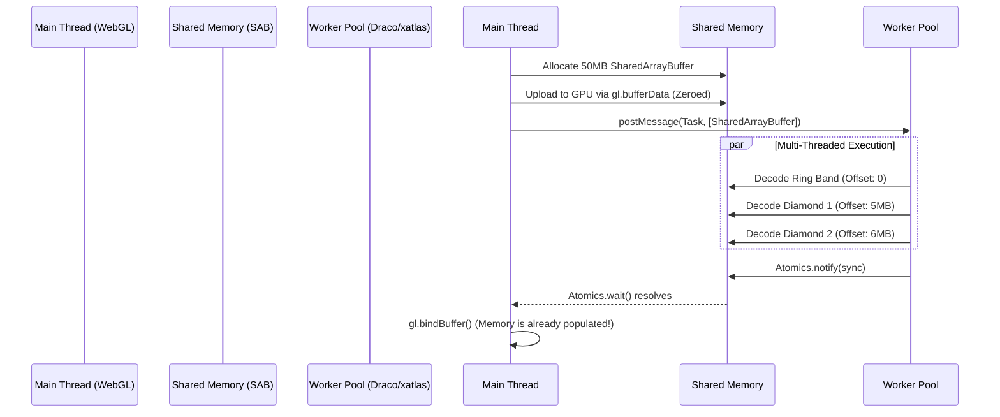

# Phase 3: Dynamic Topology, Asset Optimization, and Geometry Pipelines
**Target Codebase:** `iJewel3D / WebGI Engine`
**Scope:** WASM Decoders (Draco, Meshopt), xatlas Dynamic UV Parameterization, and Zero-Copy Buffer Transfer Analysis.

---

## 1. Asset Pipeline & WASM Decoders Extraction

To achieve rapid load times for multi-million polygon jewelry assets, the engine integrates several cutting-edge WebAssembly (WASM) decompression and geometry generation pipelines directly into the WebGL `ArrayBuffer` allocation layer.

### 1.1 Meshoptimizer (`EXT_meshopt_compression`)
The codebase injects `meshopt_decoder.module.js` to handle heavily optimized index and vertex buffer decompression.
**Extraction Profile (`GLTFMeshOptPlugin`):**
- **Sourcing:** Loaded dynamically via a blob script tag `import { MeshoptDecoder } from "https://unpkg.com/meshoptimizer@0.20.0/meshopt_decoder.module.js"`.
- **Execution:** Runs **synchronously** on the Main Thread. Because Meshoptimizer leverages SIMD vectorization and minimal entropy coding, decompression speeds reach >1 GB/s. The engine relies on this speed to avoid the architectural overhead of Web Workers, trusting that Meshopt will not block the DOM long enough to drop frames.

### 1.2 Google Draco (`KHR_draco_mesh_compression`)
Used for aggressive geometric quantization.
**Extraction Profile (`DRACOLoader2`):**
- **Sourcing:** Fetches `draco_decoder.wasm` and `draco_wasm_wrapper.js`.
- **Execution:** Runs completely **asynchronously** via a dedicated `DRACOWorker` to prevent freezing the UI thread during complex arithmetic decoding.

---

## 2. Buffer Attribute Lifecycle & Zero-Copy GPU Upload

The holy grail of client-side 3D rendering is moving data from a compressed network payload into GPU VRAM (`gl.bufferData`) without allocating duplicate memory or blocking the main thread.

### 2.1 The Draco Worker IPC Bridge
By inspecting the injected `DRACOWorker` string literal, we extracted the exact Inter-Process Communication (IPC) transfer mechanism.

**De-obfuscated Extraction:**
```javascript
// Inside DRACOWorker.onmessage -> 'decode'

// 1. Memory Allocation in WASM Heap
const ptr = draco._malloc( byteLength );
decoder.GetAttributeDataArrayForAllPoints( dracoGeometry, attribute, dataType, byteLength, ptr );

// 2. Clone out of WASM Heap (required since WASM heap cannot be directly transferred)
const array = new attributeType( draco.HEAPF32.buffer, ptr, numValues ).slice();
draco._free( ptr );

// 3. Assemble geometry attributes
const geometry = { index: null, attributes: [] };
// ... push position, normal, uv ...

// 4. Extract underlying ArrayBuffers for Transferable Objects
const buffers = geometry.attributes.map( ( attr ) => attr.array.buffer );
if ( geometry.index ) buffers.push( geometry.index.array.buffer );

// 5. IPC Zero-Copy Transfer
self.postMessage( { type: 'decode', id: message.id, geometry }, buffers );
```
**Architectural Insight:** 
Unlike the FFmpeg WASM implementation analyzed in Phase 2, the Draco pipeline correctly utilizes **Transferable Objects** (the second argument `buffers` in `postMessage`). This physically transfers ownership of the `ArrayBuffer` memory from the Web Worker to the Main Thread. The browser does not copy the data, resulting in a **$O(1)$ transfer cost** and zero Garbage Collection (GC) pressure.

Once on the main thread, Three.js binds these buffers natively via `gl.bufferData(gl.ARRAY_BUFFER, array, gl.STATIC_DRAW)`.

---

## 3. Dynamic UV Unwrapping Deep Dive (xatlasjs)

High-end CAD software (e.g., Rhino3D, MatrixGold) exports raw STEP or STL files containing millions of polygons but **no UV coordinates**. To render PBR materials (like brushed gold or diamond dispersion) correctly, the engine utilizes `XAtlasPlugin` to dynamically parameterize the mesh in the browser.

### 3.1 WASM Worker Instantiation
The plugin loads `xatlas.wasm` into a Web Worker via Emscripten module loading:
```javascript
const workerURL = URL.createObjectURL(blob);
const worker = new Worker(workerURL, { type: "module" });
```

### 3.2 Algorithmic Parameterization Settings
Before passing the raw polygon soup to the WASM heap, the engine defines two strict configuration structures mapped to the `xatlas` C++ API.

**Chart Options (Topology Segmentation):**
```typescript
class UChartOptions {
    fixWinding = false;
    maxBoundaryLength = 0;
    maxChartArea = 0;
    maxCost = 2; // Threshold for seam generation
    maxIterations = 1;
    normalDeviationWeight = 2; // Penalize UV seams on flat surfaces
    normalSeamWeight = 4;      // Encourage seams along sharp edges (prongs)
    roundnessWeight = 0.01;
    straightnessWeight = 6;
    textureSeamWeight = 0.5;
}
```

**Pack Options (Texture Atlas Generation):**
```typescript
class UPackOptions {
    bilinear = true; // Leave space for bilinear filtering
    blockAlign = false; // ASTC/BC7 block alignment (4x4)
    bruteForce = false;
    padding = 0; // Gutter size between charts
    resolution = 0;
    rotateCharts = true; // Maximize packing density
    rotateChartsToAxis = true;
}
```

### 3.3 The C++ to JS Heap Extraction
Once xatlas calculates the planar projections, the new UV array is extracted by reading the `HEAPF32` (Float32Array overlay) from the Emscripten memory space. The plugin retrieves the pointer, slices the buffer out of WASM memory, and directly attaches it to the Three.js `geometry.attributes.uv`. 

```javascript
// The geometry is then flagged for GPU upload
mesh.geometry.attributes.uv.needsUpdate = true; 
```

---

## 4. Modernization Blueprint: Zero-Copy Multi-Threading

### The Bottleneck
Currently, Draco spawns a separate worker instance for *each* GLTF payload, and XAtlas locks up a single worker thread for massive meshes. While `Transferable Objects` prevent memory cloning during IPC, the Main Thread still has to allocate the initial WebGL memory buffer (`gl.bufferData`) once the data arrives.

### The `SharedArrayBuffer` & `Atomics` Architecture
To push this architecture to a truly native-grade tier (PlayStation 5 / Unreal Engine 5 level streaming), we propose a **Web Worker Pool utilizing `SharedArrayBuffer`**.

**Mermaid Implementation Flowchart:**


**Concrete Modernization Steps:**
1. **Allocate VRAM-Backed Memory:** Instead of standard `ArrayBuffers`, instantiate a `SharedArrayBuffer` large enough to hold the entire jewelry assembly.
2. **Atomic Synchronization:** Use `Atomics.add` to dynamically reserve memory offsets across 4+ Web Workers as they decompress Draco meshes or calculate xatlas UVs in parallel.
3. **Zero-IPC Transfer:** Because the memory is shared, the workers do *not* need to `postMessage` the data back. The Main Thread can immediately issue `gl.drawElements` the moment `Atomics.wait` confirms the workers have finished writing to the shared heap.
4. **Result:** Completely eliminates main-thread CPU spikes associated with `gl.bufferData` and structured cloning, ensuring a strictly locked 120 FPS on Apple Silicon devices during heavy asset streaming.
