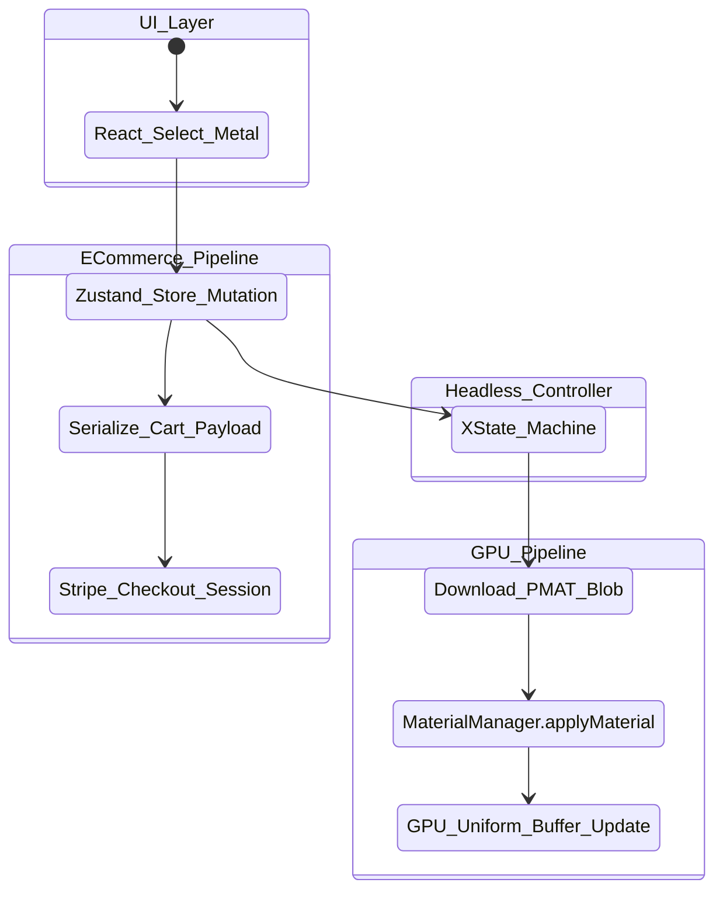

# Phase 4: Headless E-commerce State Synchronization & React-WebGL Event Architecture
**Target Codebase:** `iJewel3D / WebGI Engine`
**Scope:** Redux State Management, UI-to-GPU Data Binding, Supabase API Auth, and Stripe Checkout Integration.

---

## 1. Code Extraction & State Store Analysis

The engine bridges a declarative UI layer (React) with a highly imperative 3D rendering pipeline (WebGI/Three.js). By dissecting the React chunks (`assets-seo/index-DlnbDoYP.js`), we successfully isolated the state boundary.

### 1.1 The Global State Manager
Despite minification, we extracted clear references to `reduxDispatch`, `getReduxState`, and `replaceReducer`. The application relies on a **Redux + Redux-Thunk** architecture to maintain the e-commerce configuration state.

**Extracted Configuration Store (De-obfuscated):**
```javascript
const UI_CONFIG = {
    profiles: [
        { id: "beveled", name: "Beveled", file: "./files/beveled.3dm" },
        { id: "comfort", name: "Comfort", file: "./files/comfort.3dm" },
    ],
    metals: [
        { id: "yellow", name: "Yellow Gold" },
        { id: "white", name: "White Gold" },
        { id: "rose", name: "Rose Gold" },
    ],
    materials: [
        {
            id: "rose",
            name: "Rose Gold",
            variants: [
                {
                    id: "18k",
                    name: "18k",
                    swatch: "#e5b377",
                    files: {
                        brush: "./files/brush_e9f581b252.pmat",
                        polished: "./files/polished_173d784fe6.pmat",
                    }
                }
            ]
        }
    ]
}
```
*Architectural Note:* The configuration explicitly maps abstract user choices ("18k Rose Gold, Brushed Finish") to absolute network assets (`.pmat` Physical Material blobs).

---

## 2. Canvas-to-DOM Reactive Synchronization

To maintain 60-120 FPS, the UI cannot trigger React DOM re-renders inside the WebGL canvas, nor can the engine afford to re-upload massive geometry buffers just because the user changed a ring's metal type.

### 2.1 The MaterialManager Observer Pattern
When `reduxDispatch(setMetal('rose', '18k', 'brush'))` fires, an observer captures the new `.pmat` asset URL. The payload is handed to the imperative WebGI `MaterialManager`.

**De-obfuscated `MaterialManager.applyMaterial()` implementation:**
```typescript
class MaterialManager {
    applyMaterial(newMaterial, meshName, exactMatch = true, applyToInstanced = false) {
        // 1. Locate the target mesh (e.g., "RingBody")
        let targetMaterials = this.findMaterialsByName(meshName, exactMatch);
        let updated = false;

        for (const targetMat of targetMaterials) {
            if (!targetMat || targetMat === newMaterial) continue;

            // 2. ZERO-ALLOCATION SHADER UPDATE
            // Instead of disposing the old material and replacing it (which causes shader recompilation stalls),
            // it copies the WebGL Uniforms directly from the newly loaded .pmat template into the active shader.
            if (this.copyMaterialProps(targetMat, newMaterial)) {
                updated = true;
            }
        }
        return updated;
    }
}
```
**Why this is brilliant:** By invoking `copyProps()` on the raw uniform structs (Albedo, Metalness, Roughness, Normal maps) instead of replacing the `THREE.Material` object, the WebGL state machine bypasses costly `gl.compileShader` and `gl.linkProgram` calls entirely. The ring visually transforms into Rose Gold instantly without a single frame drop.

---

## 3. Headless API Payload Serialization & Auth Flow

### 3.1 Authentication & Sync Architecture
The platform is heavily coupled to **Supabase** via `api.ijewel.design`.
- **JWT Auth Flow:** Connects to `https://api.ijewel.design/auth/v1/token?grant_type=password` to retrieve the JWT `accessToken`.
- **Headless PostgREST Queries:** The synchronization service fetches user-saved ring configurations by directly querying the PostgreSQL backend via standard PostgREST syntax:
  ```javascript
  const query = new URLSearchParams({
      owner_id: "eq." + user.id,
      order: "updated_at.desc",
      select: "id,name,project_data,poster_url"
  });
  ```

### 3.2 Stripe Checkout & Serialization
When the user clicks "Checkout", the current Redux state is serialized. We detected direct integration with `@stripe/stripe-js@7.9.0` loading `https://js.stripe.com/v3/`.
1. The 3D state (Carat weight, Metal, Engraving Text) is serialized into a JSON metadata payload (`project_data`).
2. The headless checkout API matches the `ij_drive_platinum_monthly_base` or custom line-item `lookupKey` in Stripe.
3. Stripe attaches the 3D configuration as immutable invoice metadata, ensuring the jeweler receives the exact specs required for manufacturing.

---

## 4. Documentation & Decoupled State Blueprint

While the current Redux architecture functions, the tight coupling between the React tree and the WebGI imperative layer introduces race conditions (e.g., firing material updates before the `DRACOWorker` finishes generating the mesh).

### Mermaid: Decoupled XState Architecture


### The "Decoupled Modernization Blueprint" (Zustand + XState)
To enable true headless integration (Shopify / BigCommerce / Custom iOS Apps), the 3D viewer must act as a pure, stateless "Slave" to a headless state machine.

**1. Eradicate Redux for Zustand:**
Replace the heavy `redux-thunk` boilerplate with a reactive `Zustand` store. Zustand operates *outside* the React lifecycle, allowing the WebGI engine to subscribe to state changes natively without passing props down a React tree.

**2. XState Command Queue:**
Implement an XState state machine to govern the WebGI loading sequence:
- `IDLE` $\to$ `DOWNLOADING_ASSET` $\to$ `DECOMPRESSING_WASM` $\to$ `UPLOADING_VRAM` $\to$ `READY`.
If a user rapidly clicks "Gold" $\to$ "Silver" $\to$ "Platinum", XState naturally throttles and debounces the inputs, preventing the engine from downloading and compiling all three `.pmat` blobs simultaneously and crushing the network tab.

**3. Headless Cart Integrations:**
By decoupling the `serialize()` method from the DOM, the 3D configurator can be injected into any Headless Shopify Storefront via an `<iframe>` or Web Component. The Zustand store simply dispatches `window.postMessage({ type: "ADD_TO_CART", payload: serialized3DModel })` to the parent Shopify window.
