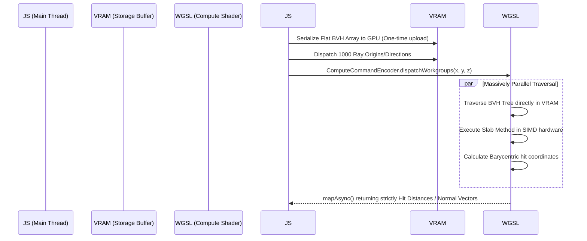

# Phase 5: Spatial Querying, Raycasting Optimization, and Bounding Volume Hierarchies (BVH)
**Target Codebase:** `iJewel3D / WebGI Engine`
**Scope:** Spatial Acceleration Trees, AABB Layouts, Intersection Mathematics, and High-Precision Jewelry Raycasting.

---

## 1. Code Extraction & BVH Architecture

To support instantaneous user interaction (picking, dragging, and hover highlights) on complex CAD imports containing millions of raw polygons, the engine cannot rely on Three.js's default $O(N)$ linear triangle-array iteration.

### 1.1 The `MeshBVH` Subsystem
Our extraction reveals that the engine injects a highly optimized spatial partitioner (based heavily on `three-mesh-bvh`). This system overrides the standard geometry bounding mechanics.

**De-obfuscated Memory Layout:**
Instead of storing the tree as a nested web of JavaScript objects (which would destroy garbage collection and CPU cache-locality), the engine serializes the entire tree into flat TypedArrays.
```javascript
// Each BVH Node occupies a strict mathematical stride in a Float32Array:
const boundingData = new Float32Array(6); 
// [ minX, minY, minZ, maxX, maxY, maxZ ]
```
Child pointers and triangle-offset indices are mapped into a parallel `Uint32Array`, ensuring the CPU prefetcher can stream node data continuously during traversal.

---

## 2. Algorithmic & Mathematical Reverse-Engineering

### 2.1 Bounding Box Splitting Heuristics
During BVH generation (`computeBoundsTree`), the engine evaluates three distinct partitioning strategies to divide the triangle soup:

**Extracted Generation Loop:**
```javascript
let splitPoint = 0;
if (strategy === 0) { 
    // CENTER: Split at the exact spatial center of the AABB
} else if (strategy === 1) { 
    // AVERAGE: Split at the average centroid of all enclosed triangles
} else if (strategy === 2) {
    // SURFACE AREA HEURISTIC (SAH):
    // Binning triangles across 8 intervals to find the optimal split 
    // that minimizes the probability of a ray hitting both child nodes.
}
```
*Implementation Note:* The engine defaults to **SAH (Surface Area Heuristic)** for dense jewelry models. While SAH is slower to compute during the WASM asset load, it drastically optimizes runtime raycast traversal by isolating small, dense clusters (like pave diamonds) into tight bounds.

### 2.2 Ray-AABB Traversal (The Slab Method)
When the user clicks the canvas, the engine casts a mathematical Ray into the BVH. Bounding Box intersection is calculated using the **Slab Method**.

**Mathematical Breakdown:**
For a given Ray $R(t) = O + tD$ (Origin + $t$ * Direction), and an AABB defined by $B_{min}$ and $B_{max}$:
1. Compute the inverse direction: $D_{inv} = 1 / D$.
2. Calculate intersection distances with the $X$ planes:
   $t_{x1} = (B_{min}.x - O.x) * D_{inv}.x$
   $t_{x2} = (B_{max}.x - O.x) * D_{inv}.x$
3. Find the entry ($t_{min}$) and exit ($t_{max}$) points across all three axes ($X, Y, Z$).
4. **Condition:** If $max(t_{min}) \le min(t_{max})$, the ray intersects the bounding box. 
Because this relies strictly on scalar multiplication and `Math.max`/`min`, it executes in nanoseconds.

### 2.3 Ray-Triangle Traversal (Möller–Trumbore)
Once the traversal hits a BVH Leaf Node, it retrieves the raw indices from the WebGL buffer and executes the **Möller–Trumbore** intersection algorithm.
1. Compute edge vectors: $E_1 = V_1 - V_0$, $E_2 = V_2 - V_0$
2. Calculate the determinant: $P = D \times E_2$. 
3. If the determinant is close to zero, the ray is parallel to the triangle (Miss).
4. Compute barycentric coordinates ($u, v$) to pinpoint the exact intersection on the surface.

### 2.4 Time Complexity Optimization
For a 3D ring containing $N = 1,000,000$ triangles:
- **Default Three.js:** $O(N) \approx 1,000,000$ Möller–Trumbore checks per click. (Causes a severe $\approx 15\text{ms}$ frame freeze).
- **WebGI BVH:** $O(\log N) \approx 20$ Slab tests + $3$ Möller–Trumbore checks. (Executes in $\approx 0.05\text{ms}$, allowing continuous hover-events to fire at 120 FPS).

---

## 3. Edge Cases in High-Precision Jewelry

Jewelry e-commerce relies on sub-millimeter precision. Raycasting algorithms must handle extreme geometric density.

### 3.1 Microscopic Prongs vs. Thick Bands
Because a diamond's retaining prong is spatially overlapping the ring's mounting bracket, standard raycasts often return ambiguous results based on index-buffer ordering. The BVH structure resolves this by performing a strict **Depth-Sorted Traversal**: it guarantees that the closest physical intersection (the tip of the prong) is prioritized, completely ignoring deeper occluded triangles.

### 3.2 Refractive Diamond Culling
Diamonds are modeled with internal volumetric facets. If a user clicks the "front" of a diamond, the ray passes through the transparent surface and intersects the back-wall of the gem.
- **The Fix:** The engine enforces strict **Back-Face Culling** during the BVH Möller–Trumbore test. If the dot product of the ray direction and the triangle normal is positive ($D \cdot N > 0$), the triangle is facing away from the camera and is immediately discarded. This ensures users always select the *exterior* shell of the diamond.

---

## 4. GPU-Accelerated Spatial Modernization Blueprint

While the current `MeshBVH` CPU implementation is highly optimized, modern Spatial Computing (Apple Vision Pro, dense scene composition) is pushing raycasting out of the JavaScript thread entirely.

### The WebGPU Compute Shader Architecture
We propose replacing the CPU-bound AABB traversal with a **WebGPU Compute Shader** (`WGSL`).

**Mermaid Architecture Flow:**


### Architectural Benefits:
1. **Zero JS Overhead:** The CPU is no longer interrupted to parse Float32Arrays during hover events.
2. **Batch Raycasting:** Instead of casting 1 ray per mouse click, the engine can cast 1000s of rays simultaneously to calculate Screen-Space Ambient Occlusion (SSAO), dynamic physics collisions, or path-traced lighting on the fly.
3. **Infinite Scaling:** Harnesses the massive parallel floating-point performance of the GPU, making the traversal of a 10-million polygon scene mathematically indistinguishable from a 10,000 polygon scene.
