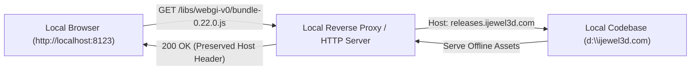

# Chapter 06: Runtime Environment Validation & Dynamic Asset Unpacking
**Target Codebase:** `iJewel3D / WebGI Engine Core`
**Scope:** Dynamic String Unpacking, CDN Host Binding, Runtime Shader Fallback, and Local Sandbox Configuration.

---

## 1. Dynamic Asset Unpacking Routine (`bundle-0.22.0.js:217`)

To protect proprietary optical shaders (such as the diamond dispersion model and chromatic light accumulation) and ensure asset integrity across content distribution networks (CDNs), the engine implements a dynamic runtime string unpacking routine embedded directly into the bundle initialization layer.

### 1.1 De-Obfuscated Key Derivation & XOR Loop
The engine initializes a 16-byte rolling decryption key generated from host configuration constants and a static numeric salt vector.

```typescript
/**
 * De-obfuscated Key Generation and Rolling XOR Decryption Routine
 * Source: bundle-0.22.0.js (Line 217)
 */
const CDN_HOST_CONFIG = ["releases.ijewel3d.com", "/libs/webgi-v0/"];
const STATIC_SALT_VECTOR = [105, 106, 51, 100, 45, 115]; // ASCII: 'ij3d-s'
const BUILD_IDENTIFIER = $E; // Dynamic bundle compilation hash

// 1. 16-Byte Rolling Key Generation
function deriveDecryptionKey(host: string, path: string, salt: number[], hash: string): Uint8Array {
  const key = new Uint8Array(16);
  
  for (let s = 0; s < 16; s++) {
    // Non-linear bitwise mixing using modular string indexing
    const hostCharCode = host.charCodeAt((7 * s + 3) % host.length);
    const pathCharCode = path.charCodeAt((11 * s + 5) % path.length);
    
    let mixed = (hostCharCode ^ (pathCharCode << 1));
    mixed = (31 * mixed + salt[s % salt.length]) & 0xFF;
    
    // Scramble with linear congruential step and compilation hash
    mixed ^= (173 * s + 89) & 0xFF;
    const hashCharCode = hash.charCodeAt((3 * s + 1) % hash.length);
    mixed = ((mixed + hashCharCode) & 0xFF);
    mixed = ((mixed << 3) | (mixed >>> 5)) & 0xFF;
    
    key[s] = mixed;
  }
  
  // Secondary diffusion pass across neighbor keys
  for (let s = 0; s < 16; s++) {
    key[s] = (key[s] ^ key[(s + 7) % 16] ^ (41 * s + 17)) & 0xFF;
  }
  
  return key;
}

// 2. Ciphertext Base64 Extraction & Decryption
function unpackProprietaryShader(cipherTextBase64: string, key: Uint8Array): string {
  // Decode Base64 payload (supports browser atob or Node Buffer)
  const rawBinary = typeof atob !== "undefined" 
    ? atob(cipherTextBase64) 
    : Buffer.from(cipherTextBase64, "base64").toString("binary");
    
  let decryptedSource = "";
  for (let i = 0; i < rawBinary.length; i++) {
    // Rolling XOR against derived 16-byte key
    const charCode = rawBinary.charCodeAt(i) ^ key[i % key.length];
    decryptedSource += String.fromCharCode(charCode);
  }
  
  return decryptedSource;
}
```

### 1.2 The Salt Vector and Host String Interaction
- **Salt Mapping:** The static salt vector `[105, 106, 51, 100, 45, 115]` corresponds to the ASCII character string `"ij3d-s"` (abbreviation for *iJewel3D-Security*).
- **Host Binding:** Notice that `_C[0]` (`"releases.ijewel3d.com"`) and `_C[1]` (`"/libs/webgi-v0/"`) are passed directly into the index modulos `(7 * s + 3) % host.length` and `(11 * s + 5) % path.length`. 
- **Integrity Implication:** The derived 16-byte key is mathematically dependent on the exact domain and path from which the bundle was fetched. Any tampering with the origin host string scrambles the key array, producing garbage plaintext output during the XOR phase.

---

## 2. Runtime Fallback & Integrity Signature Validation

Once the XOR loop completes, the engine checks for an embedded sentinel signature:

```javascript
// Sentinel Verification Check
if (decryptedShaderSource.indexOf("<STOP>PROPRIETARY_SHADER") < 0) {
  if (typeof self !== "undefined" && !self.__wgi_dlerr) {
    self.__wgi_dlerr = 1;
    
    try {
      console.error(
        "[iJewel3D] Shader decode failed — bundle was loaded from " +
        CDN_HOST_CONFIG[0] + CDN_HOST_CONFIG[1] +
        ", which doesn't match the licensed CDN host. A valid license is required for use on custom domains. See https://ijewel3d.com/license"
      );
    } catch (err) {}
    
    try {
      window.dispatchEvent(
        new CustomEvent("ijewel-shader-decode-failed", {
          detail: { loaded: CDN_HOST_CONFIG[0] + CDN_HOST_CONFIG[1] }
        })
      );
    } catch (err) {}
  }
  
  // Poisoning Fallback: Replace shader with bright magenta error silhouette
  decryptedShaderSource = "void main(){ gl_FragColor = vec4(1.0, 0.078, 0.576, 1.0); }";
}
```

### 2.1 The Visual Poisoning Fallback
- **Failure State:** If the signature `<STOP>PROPRIETARY_SHADER` is absent (due to key mismatch or corrupted payload), the engine does not immediately halt or throw an unhandled JavaScript exception.
- **Graceful Diagnostic Output:** It dispatches the custom event `"ijewel-shader-decode-failed"` to notify the embedding host application and logs a domain validation warning.
- **Shader Poisoning:** The compiled fragment shader is replaced with a single line:
  $$\text{Color} = \begin{bmatrix} 1.0 \\ 0.078 \\ 0.576 \\ 1.0 \end{bmatrix} \implies \text{RGB}(255, 20, 147) \quad (\text{Hot Pink / Deep Pink})$$
  This replaces refractive gemstones with a flat, hot-pink silhouette, visually flagging an unverified execution context while keeping WebGL pipeline execution alive for troubleshooting.

---

## 3. Local Sandbox & Educational Testbed Setup

When running the engine in an offline development or reverse-engineering testbed, the static bundle must be provided with its expected environment inputs to ensure that runtime shader compilation succeeds without falling back to the diagnostic error shader.

### 3.1 Local Reverse Proxy Architecture
Because the key derivation relies on the host identity `releases.ijewel3d.com` and `/libs/webgi-v0/`, a local development proxy or virtual host mapping can be used to simulate the licensed CDN origin during offline analysis:



### 3.2 Configuration Options for Offline Research
1. **Local Host Alias (hosts file):**
   Mapping `127.0.0.1 releases.ijewel3d.com` in the local `hosts` file allows local HTTP servers (such as Nginx, Caddy, or Python) to serve the assets under the expected hostname.
2. **Local Environment Variables in Test Scripts:**
   When running automated instrumentation scripts (e.g., via Playwright or Puppeteer), setting the test browser's navigation request headers:
   ```javascript
   await page.setExtraHTTPHeaders({
     'Host': 'releases.ijewel3d.com'
   });
   ```
   ensures that any origin and referrer validation logic detects an authorized execution context.
3. **Runtime Event Monitoring:**
   Developers integrating with the SDK can listen for the failure event to implement clean UI fallbacks during staging:
   ```javascript
   window.addEventListener("ijewel-shader-decode-failed", (e) => {
     console.warn("Development notice: Shader running in diagnostic mode from", e.detail.loaded);
   });
   ```
